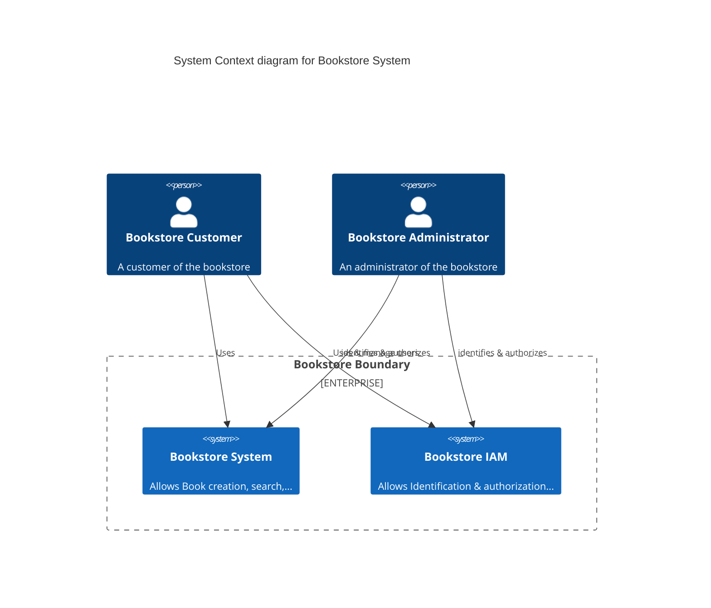

# REST APIs Versionning: Hands-on !

This workshop aims to introduce different ways to handle and propose several versions of a same API to your customers.

## Big picture of the application

## Our API Roadmap

## Dealing with updates without versionning

## Our first version

In the URI, in a header, a mix between the gateway & the apps

### SCM & Configuration management

## Customer's management

## Dealing with conflicts

## Authorization