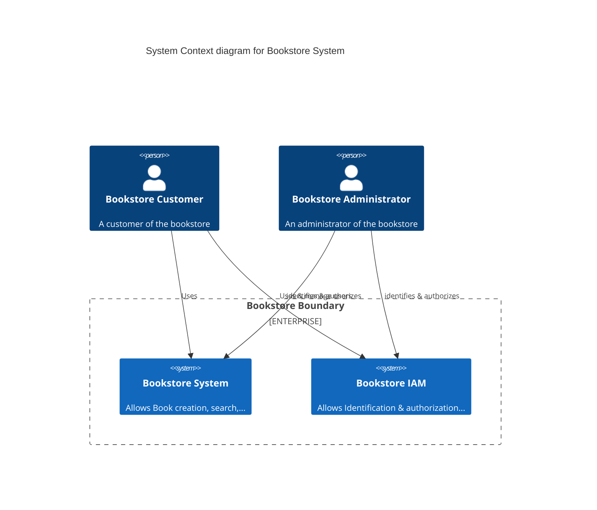
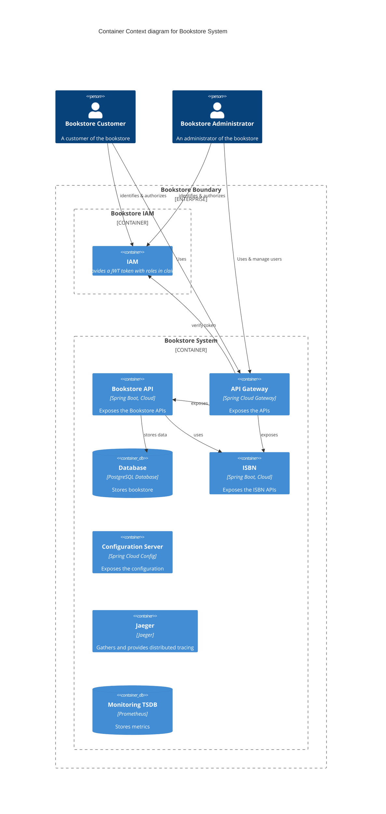
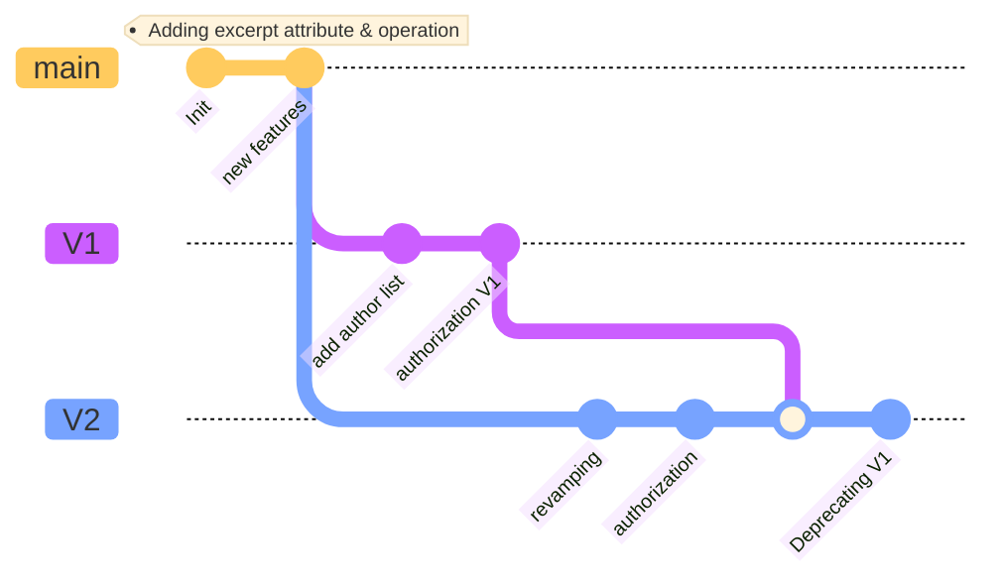

# REST APIs Versioning: Hands-on !

This workshop aims to introduce different ways to handle and propose several versions of a same API to your customers.

## :dart: Big picture

During this workshop we will strive with API versioning on a (small) microservice application.
Here is a short description of it.

This platform aims to store and get books of a bookstore.

### System View 



#### Explanations

Here we have two main kind of users:

* Customer : He can browse and create books
* Administrator: He can create books and activate/deactivate the maintenance mode

Within our platform, we have two main systems:

* Bookstore system which operate all the book related operations
* Bookstore IAM which is responsible for identifying and authorizing users

### Container view



#### Explanations

This diagram dig into the systems exposed above in the system view.

The Bookstore system is composed of:
* The API Gateway which exposes our APIs
* The Bookstore API which exposes all the related book APIs and stores data to a PostgreSQL database
* The ISBN API which provides random ISBN numbers
* A Configuration server which centralizes all the configuration files

The Bookstore IAM is composed of:
* A mock server which provides JWT token with appropriate roles and information

### :straight_ruler: Stack
Here is a summary of the stack used in this workshop for this architecture:

| Container | Tools | Comments |
|---|---|---|
| API Gateway | Spring Cloud Gateway 2021.0.4  |  |
| Bookstore API | JAVA 17,Spring Boot 2.7.X |  |
| ISBN API | JAVA 17,Spring Boot 2.7.X |  |
| Configuration Server | Spring Cloud Config 2021.0.4 |  |
| Database | PostgreSQL |  |
| Authorization Server | JAVA 17,Spring Boot 2.7.X, Spring Authorization Server 0.3.1 |  |


### Customers

## Our API Roadmap



## :traffic_light: Prerequisites

### :mortar_board: Skills

| Skill                                                                                                                                                                                                                                                                                   | Level | 
|-----------------------------------------------------------------------------------------------------------------------------------------------------------------------------------------------------------------------------------------------------------------------------------------|---|
| [REST API](https://google.aip.dev/general)                                                                                                                                                                                                                                              | proficient |
| [Java](https://www.oracle.com/java/)                                                                                                                                                                                                                                                    | novice |   
| [Gradle](https://gradle.org/)                                                                                                                                                                                                                                                           | novice |
| [Spring Framework](https://spring.io/projects/spring-framework), [Boot](https://spring.io/projects/spring-boot), [Cloud Config](https://docs.spring.io/spring-cloud-config/docs/current/reference/html/#_quick_start), [Cloud Gateway](https://spring.io/projects/spring-cloud-gateway) [Spring Authorization Server](https://docs.spring.io/spring-authorization-server/docs/current/reference/html/index.html)| novice |
| [OpenID Connect](https://openid.net/connect)                                                                                                                                                                                                                                            | novice |]
| [Docker](https://docs.docker.com/)                                                                                                                                                                                                                                                      | novice |

### :wrench: Tools 
#### If you want to execute this workshop locally
You must have set up these tools first:
* [Java 17+](https://adoptium.net/temurin/releases/?version=17)
* [Gradle 7.5+](https://gradle.org/)
* [Docker](https://docs.docker.com/) & [Docker compose](https://docs.docker.com/compose/)
* Any IDE ([IntelliJ IDEA](https://www.jetbrains.com/idea), [VSCode](https://code.visualstudio.com/), [Netbeans](https://netbeans.apache.org/),...) you want
* [cURL](https://curl.se/), [jq](https://stedolan.github.io/jq/), [HTTPie](https://httpie.io/) or any tool to call your REST APIs

#### :rocket: If you don't want to bother with a local setup

You can use [Gitpod](https://gitpod.io).
You must create an account first.
You then can open this project in either your local VS Code or directly in your browser:

[](https://gitpod.io/#github.com/alexandre-touret/rest-apis-versioning-workshop.git)

## :boom: Ready ?

:warning: I **strongly** suggest to fork this project into your personal GitHub namespace. You then can change the URL mentioned above to link GitHub and Gitpod:

```markdown
[](https://gitpod.io/#github.com/%%MY_NAMESPACE%%/rest-apis-versioning-workshop.git)
```

or you can directly browse this URL (think to change the ``%%MY_NAMESPACE%%`` prefix):

``https://gitpod.io/#github.com/%%MY_NAMESPACE%%/rest-apis-versioning-workshop.git``

Now, you can start [the workshop](./docs/index.md).