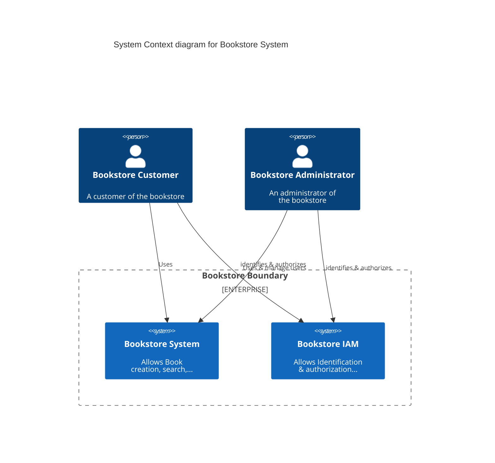
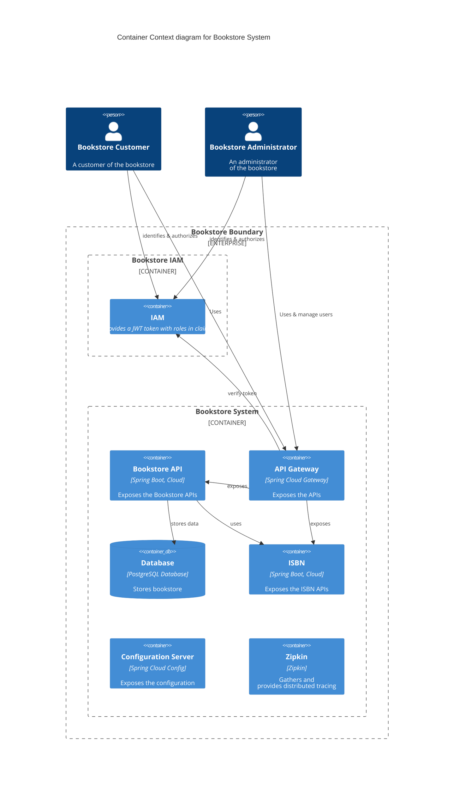
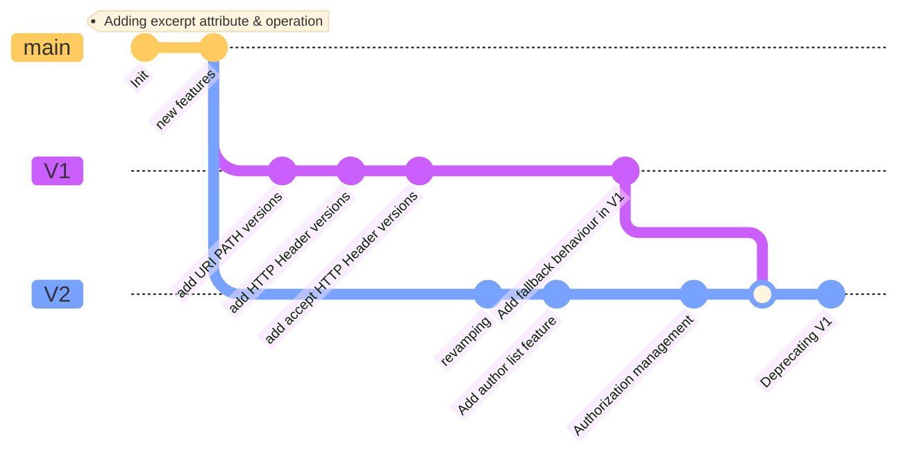

# REST APIs Versioning: Hands-on !

This workshop aims to 
- Introduce REST API Versioning 
- Highlight API breaking and non breaking changes
- Dive into all the impacts: configuration, code, security,...  

## :dart: Big picture

During this workshop we will strive with API versioning on a (small) microservice application.
Here is a short description of it.

This platform aims to store and get books of a bookstore.

### System View



#### Explanations

Here we have two main kind of users:
* Customer : He can browse and create books
* Administrator: He can create books and activate/deactivate the maintenance mode

Within our platform, we have two main systems:

* Bookstore system which operate all the book related operations
* Bookstore IAM which is responsible for identifying and authorizing users

### Container view



#### Explanations

This diagram digs into the systems exposed above in the system view.

The Bookstore system is composed of:
* The API Gateway which exposes our APIs
* The Bookstore API which exposes all the related book APIs and stores data to a PostgreSQL database
* The ISBN API which provides random ISBN numbers
* A Configuration server which centralizes all the configuration files

The Bookstore IAM is composed of:
* A mock server which provides JWT token with appropriate roles and information.

### :straight_ruler: Stack
Here is a summary of the stack used in this workshop for this architecture:

| Container | Tools                                                        | Comments |
|---|--------------------------------------------------------------|---|
| API Gateway | Spring Cloud Gateway 2023.0.0                                |  |
| Bookstore API | JAVA 21,Spring Boot 3.2.X                                    |  |
| ISBN API | JAVA 21,Spring Boot 3.2.X                                    |  |
| Configuration Server | Spring Cloud Config 2023.0.0                                 |  |
| Database | PostgreSQL                                                   |  |
| Authorization Server | JAVA 21,Spring Boot 3.2.X, Spring Authorization Server 1.1.0 |  |


### Customers

## Our API Roadmap



## :traffic_light: Prerequisites

### :mortar_board: Skills

| Skill                                                                                                                                                                                                                                                                                   | Level | 
|-----------------------------------------------------------------------------------------------------------------------------------------------------------------------------------------------------------------------------------------------------------------------------------------|---|
| [REST API](https://google.aip.dev/general)                                                                                                                                                                                                                                              | proficient |
| [Java](https://www.oracle.com/java/)                                                                                                                                                                                                                                                    | novice |   
| [Gradle](https://gradle.org/)                                                                                                                                                                                                                                                           | novice |
| [Spring Framework](https://spring.io/projects/spring-framework), [Boot](https://spring.io/projects/spring-boot), [Cloud Config](https://docs.spring.io/spring-cloud-config/docs/current/reference/html/#_quick_start), [Cloud Gateway](https://spring.io/projects/spring-cloud-gateway) [Spring Authorization Server](https://docs.spring.io/spring-authorization-server/docs/current/reference/html/index.html)| novice |
| [OpenID Connect](https://openid.net/connect)                                                                                                                                                                                                                                            | novice |]
| [Docker](https://docs.docker.com/)                                                                                                                                                                                                                                                      | novice |

### :wrench: Tools
#### If you want to execute this workshop locally
You **MUST** have set up these tools first:
* [Java 21+](https://adoptium.net/temurin/releases/?version=21)
* [Gradle 8.5+](https://gradle.org/)
* [Docker](https://docs.docker.com/) & [Docker compose](https://docs.docker.com/compose/)
* Any IDE ([IntelliJ IDEA](https://www.jetbrains.com/idea), [VSCode](https://code.visualstudio.com/), [Netbeans](https://netbeans.apache.org/),...) you want
* [cURL](https://curl.se/), [jq](https://stedolan.github.io/jq/), [HTTPie](https://httpie.io/) or any tool to call your REST APIs

Here are commands to validate your environment:

**Java**

```jshelllanguage
java -version
openjdk version "21.0.1" 2023-10-17 LTS
OpenJDK Runtime Environment Temurin-21.0.1+12 (build 21.0.1+12-LTS)
OpenJDK 64-Bit Server VM Temurin-21.0.1+12 (build 21.0.1+12-LTS, mixed mode, sharing)
```

**Gradle**

If you use the wrapper, you won't have troubles. Otherwise...:

```jshelllanguage
gradle -version

------------------------------------------------------------
Gradle 8.5
------------------------------------------------------------

Build time:   2023-11-29 14:08:57 UTC
Revision:     28aca86a7180baa17117e0e5ba01d8ea9feca598

Kotlin:       1.9.20
Groovy:       3.0.17
Ant:          Apache Ant(TM) version 1.10.13 compiled on January 4 2023
JVM:          21.0.1 (Eclipse Adoptium 21.0.1+12-LTS)
OS:           Linux 5.15.133.1-microsoft-standard-WSL2 amd64
```

**Docker Compose**

```jshelllanguage
docker compose version
    
Docker Compose version v2.22.2
```

#### :rocket: If you don't want to bother with a local setup

##### With Gitpod (recommended)
You can use [Gitpod](https://gitpod.io).
You must create an account first.
You then can open this project in either your local VS Code or directly in your browser:

[](https://gitpod.io/#github.com/alexandre-touret/rest-apis-versioning-workshop.git)

##### With Github Codespaces
You can also [use Github Codespaces](https://docs.github.com/en/codespaces/).
You can create a new one by [running "Code > Create codespace on main"](https://docs.github.com/en/codespaces/developing-in-codespaces/creating-a-codespace-for-a-repository#creating-a-codespace-for-a-repository).

You have then to run the command in the shell:

```jshelllanguage
pip install httpie
sdk install java 21.0.1-tem
sdk default java 21.0.1-tem
```

## :boom: Ready ?
[](https://gitpod.io/#github.com/alexandre-touret/rest-apis-versioning-workshop.git)

> **If you fork this repo**
>
> Don't forget to change the "Open in GitPod" button URL:
> ```markdown
> [](https://gitpod.io/#github.com/%%MY_NAMESPACE%%/rest-apis-versioning-workshop.git)
> ```
 or you can directly browse this URL (think to change the ``%%MY_NAMESPACE%%`` prefix):

> ``https://gitpod.io/#github.com/%%MY_NAMESPACE%%/rest-apis-versioning-workshop.git``
_________________

**Now, you can start [the workshop](docs/index.md) :tada:.**
