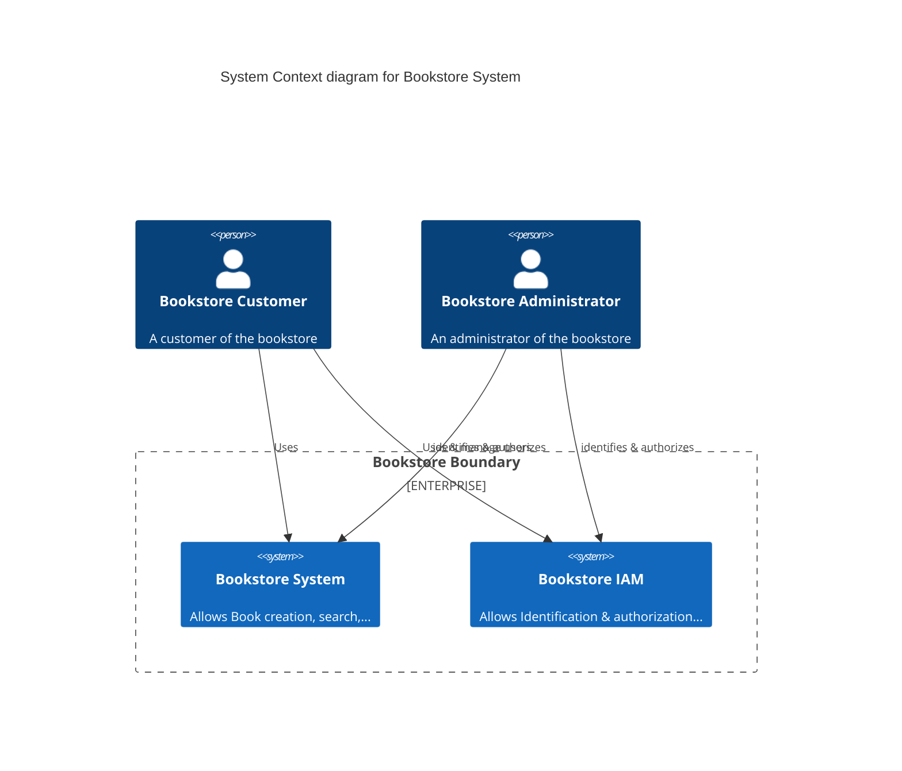
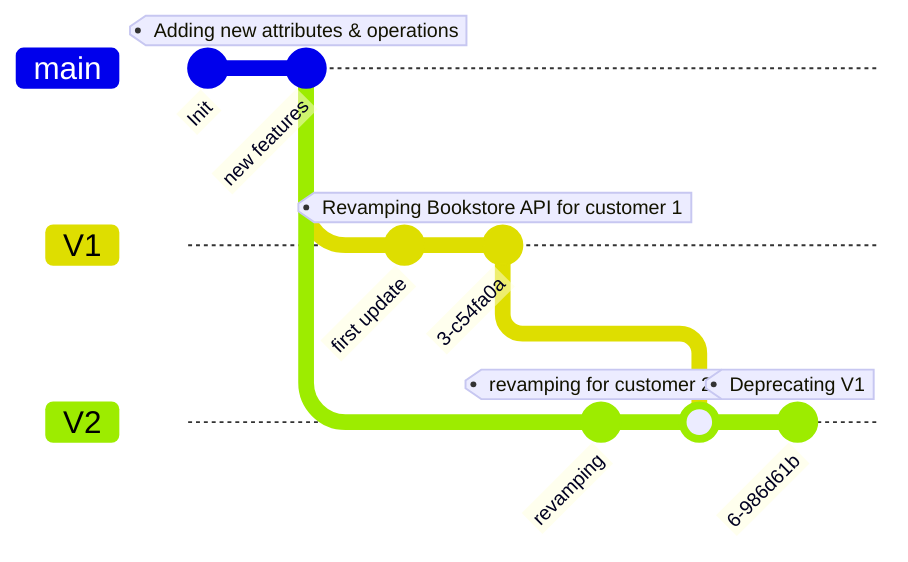

# REST APIs Versionning: Hands-on !

This workshop aims to introduce different ways to handle and propose several versions of a same API to your customers.

## Big picture

### System View

#### Explanation
Here we have two main kind of users :
* Customer : He can browse and book books
* Administrator: He can create books and activate/desactivate the maintenance mode

Within our platform, we have two main systems:
* Bookstore system which operate all the book related operations
* Bookstore IAM which is responsible for identifying and authorizing users

### Container view

### Customers

## Our API Roadmap

## Dealing with updates without versionning

## Our first version

### Creating V1

In the URI, in a header, a mix between the gateway & the apps

### SCM & Configuration management

## Customer's management

## Dealing with conflicts

## Authorization