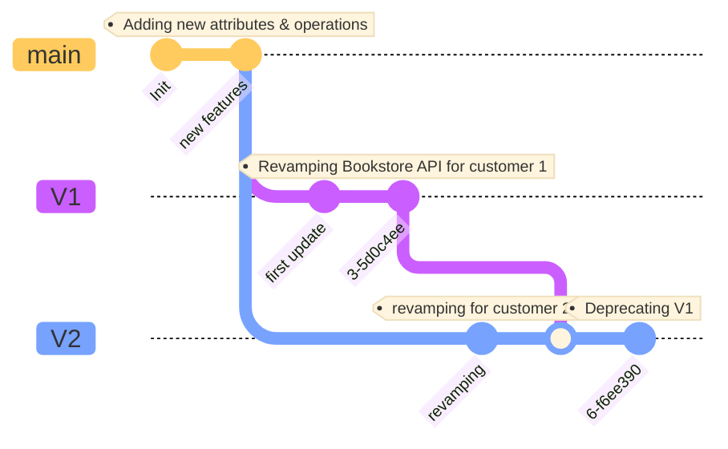

# REST APIs Versionning: Hands-on !

This workshop aims to introduce different ways to handle and propose several versions of a same API to your customers.

## :dart: Big picture

During this workshop we will strive with API versionning on a (small) microservice application.
Here is a short description of it.

This platform aims to store and get books of a bookstore.

### System View 


#### Explanations
Here we have two main kind of users :
* Customer : He can browse and book books
* Administrator: He can create books and activate/desactivate the maintenance mode

Within our platform, we have two main systems:
* Bookstore system which operate all the book related operations
* Bookstore IAM which is responsible for identifying and authorizing users

### Container view


#### Explanations

This diagram dig into the systems exposed above in the system view.

The Bookstore system is composed of:
* The API Gateway which exposes our APIs
* Bookstore API which exposes all the related book APIs and stores data to a PostgreSQL database
* ISBN API which provides random ISBN numbers
* Configuration server which centralises all the configuration files

The Bookstore IAM is composed of:
* a mock server which provides JWT token with appropriate roles and informations

### :straight_ruler: Stack
Here is a summary of the stack used in this workshop for this architecture:

| Container | Tools | Comments |
|---|---|---|
| API Gateway | Spring Cloud Gateway 2021.0.4  |  |
| Bookstore API | JAVA 17,Spring Boot 2.7.X |  |
| ISBN API | JAVA 17,Spring Boot 2.7.X |  |
| Configuration Server | Spring Cloud Config 2021.0.4 |  |
| Database | PostgreSQL |  |
| IAM Mock |  |  |


### Customers

## Our API Roadmap



## :traffic_light: Prerequisites

### :mortar_board: Skills

| Skill | Level | 
|---|---|
| REST API | proficient |
| Java | novice |
| Gradle | novice |
| Spring Framework, Gateway | novice |
| OpenID Connect | novice |
| Docker | novice |

### :wrench: Tools 
#### If you want to execute this workshop locally
You must have set up these tools first:
* Java 17+
* Gradle 7.5+
* Docker & Docker compose
* Any IDE (IntelliJ IDEA, VSCode, Emacs,...)
* [cURL](https://curl.se/), [HTTPie](https://httpie.io/) or any tool to call your REST APIs

#### :rocket: If you don't want to bother with a local setup

You can use [Gitpod](https://gitpod.io). 
You must create an account first. 

You then can open this project in either your local VS Code or directly in your browser

[](https://gitpod.io/#github.com/alexandre-touret/rest-apis-versionning-workshop.git)

## :boom: Ready ?

:warning: I strongly suggest to fork this project into your personal github namespace. You then can change the URL mentioned above to link github and gitpod:

```markdown
[](https://gitpod.io/#github.com/%%MY_NAMESPACE%%/rest-apis-versionning-workshop.git)
```

or you can directly browse this URL (think to change the ``%%MY_NAMESPACE%%`` prefix):

``https://gitpod.io/#github.com/%%MY_NAMESPACE%%/rest-apis-versionning-workshop.git``

Now, you can start [the workshop](./docs/index.md).

