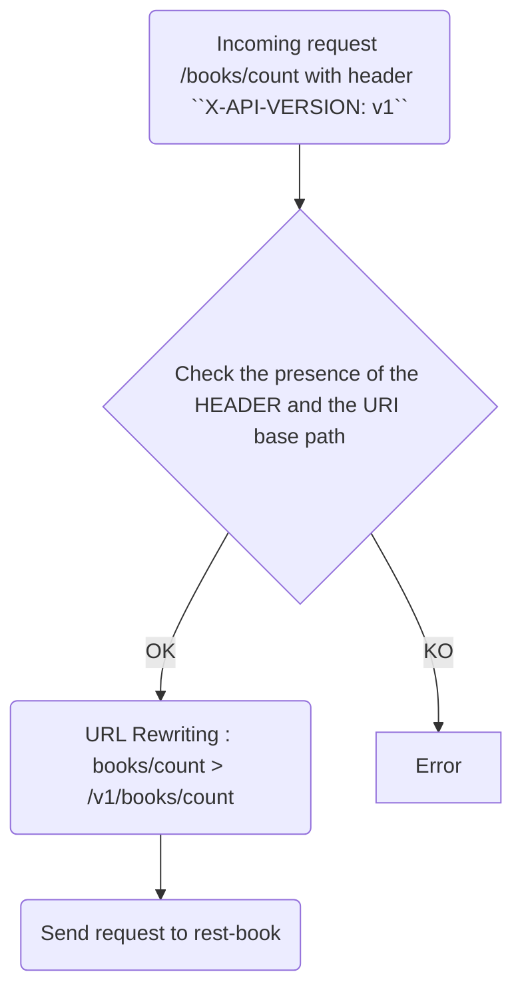

# Your first version

## TL;DR: What will you learn in this chapter?

> [!IMPORTANT]
> This chapter covers the following topics:
> 1. Pinpoint the impacts of the versioning on the OPENAPI Description file
> 2. Implement a URL Based versioning
> 3. Implement a header based versioning
> 4. Deploy and configure a default version for your API
>

## Prerequisites
We will define in this chapter our first version in the URI and in a header mixing in the gateway & the apps.

> [!WARNING]
> Before starting this chapter, please shut down all the apps already started:
> * [config server](../config-server)
> * [gateway](../gateway)
> * [authorization server](../authorization-server)
> * [rest-book](../rest-book)
> * [rest-number](../rest-number)
> 

## URI based version

In the current rest-book version,we have already defined the version in the BookController's URI.

The pattern is ``/api/%VERSION%/books``.
For instance, we could have ``/api/v1/books``.

We will shortly review the configuration already done and update the OpenAPI documentation.

### Configuration

#### Rest-Book

You can **CHECK** the default context path in
the [rest-book configuration file](../config-server/src/main/resources/config/rest-book.yml)

```yaml
server:
  servlet:
    context-path: /v1
```

**UPDATE** the [rest-book's openAPI descriptor file](../rest-book/src/main/resources/openapi.yml) adding the version in the
URL:

```yaml
openapi: 3.0.0
info:
  title: OpenAPI definition
  version: "v1"
servers:
  - url: http://localhost:8082/v1
```

Now, build the project:

```bash 
./gradlew build -p rest-book
``` 

##### Looking forward to rest-number api versioning updates

The same version is applied in both rest-book and rest-number modules.

To reach it, the same version has been applied to reach the rest-number module.
You can **CHECK** the corresponding configuration in
the [rest-book configuration file](../config-server/src/main/resources/config/rest-book.yml):

```yaml
booknumbers:
  api:
    url: http://127.0.0.1:8081/v1/isbns
```

#### Rest-Number

**CHECK** and **UPDATE** the [rest-number's openAPI descriptor file](../rest-number/src/main/resources/openapi.yml) to indicate
the version:

```yaml
openapi: 3.0.1
info:
  title: OpenAPI definition
  version: v1
servers:
  - url: http://localhost:8081/v1
```

**CHECK** the [rest-number configuration file](../config-server/src/main/resources/config/rest-number.yml) and the context
path:

```yaml
server:
  servlet:
    context-path: /v1
```

Now, build the project, **RUN**:

```bash 
./gradlew build -p rest-number
``` 

### In the gateway
**CHECK** the routes already defined in the [gateway application.yml configuration file](../gateway/src/main/resources/application.yml).

```yaml
spring:
  application:
    name: gateway
  zipkin:
    base-url: http://localhost:9411
    sender:
      type: web
  cloud:
    gateway:
      routes:
        - id: path_route
          uri: http://127.0.0.1:8082
          predicates:
            - Path=/v1/books
        - id: path_route
          uri: http://127.0.0.1:8082
          predicates:
            - Path=/v1/books/{segment}
        - id: path_route
          uri: http://127.0.0.1:8081
          predicates:
            - Path=/v1/isbns
```

### Tests

#### Startup
Normally, you Docker infrastructure should be up. If not, start it:

**RUN**:

```jshelllanguage
cd infrastructure
docker compose up
```

Start then the different applications:

In the first shell, **RUN**:

```jshelllanguage
./gradlew bootRun -p config-server
```
In the second shell, **RUN**:

```jshelllanguage
./gradlew bootRun -p authorization-server
```

In the third shell, **RUN**:

```jshelllanguage
./gradlew bootRun -p rest-book
```
In the fourth shell, **RUN**:

```jshelllanguage
./gradlew bootRun -p rest-number
```
Last but not least, in the last one, **RUN**:

```jshelllanguage
 ./gradlew bootRun -p gateway
```

You can now reach the API.

For instance, you can reach the gateway, **RUN**ing:

```jshelllanguage
http :8080/v1/books/count
```

You can also access directly to the rest-book backend:

```jshelllanguage
http :8082/v1/books/count
```

> [!TIP]
> By the way,if you run this workshop on your local desktop, you can also verify if the Swagger and OpenAPI is up-to-date by browsing these endpoints:
> * http://localhost:8082/v1/swagger-ui/index.html
> * http://localhost:8081/v1/swagger-ui/index.html
> If you run it on GitPod, change the ``localhost:8082`` to the URL specified by the Gitpod runtime. 

### Create a HTTP Header based version

In this chapter, we will put in place a rewrite/redirection mechanism in the gateway to route incoming requests regarding a header.

For this workshop we will extract the ``X-API-VERSION`` HTTP header and route to the appropriate backend.
For instance if we reach the API as following :

```jshelllanguage
http :8080/... "X-API-VERSION: v1" 
```
Our gateway will rewrite the URL and reach the good version (i.e., the version specified by the header).

You could find below a flowchart explaining the mechanism:



We will illustrate this behaviour by adding another route in the [gateway's configuration](../gateway/src/main/resources/application.yml):

Here is an example:

```yaml
  cloud:
    gateway:
      routes:
        [ ... ]
        - id: rewrite_v1
          uri: http://127.0.0.1:8082
          predicates:
            - Path=/books/{segment}
            - Header=X-API-VERSION, v1
          filters:
            - RewritePath=/books/(?<segment>.*),/v1/books/$\{segment}
        - id: rewrite_v1
          uri: http://127.0.0.1:8082
          predicates:
            - Path=/books
            - Header=X-API-VERSION, v1
          filters:
            - RewritePath=/books,/v1/books
        - id: rewrite_v1
          uri: http://127.0.0.1:8081
          predicates:
            - Path=/isbns
            - Header=X-API-VERSION, v1
          filters:
            - RewritePath=/isbns,/v1/isbns
```

Restart the gateway:

* Type CTRL+C first in the gateway console
* Run it again:
```jshelllanguage
./gradlew bootRun -p gateway
```

Now you can reach your versioned API in two ways:
1. By adding the version in the URI (e.g., ``/v1/books``)
2. By putting an HTTP header in the HTTP request

You can now test your API using this new way:

```jshelllanguage
http :8080/books/count "X-API-VERSION: v1" 
```

You can use now some dedicated scripts for this new approach:

* ``bin/countBooks-header.sh``
* ``bin/createBook-header.sh``
* ``bin/randomBook-header.sh``
* ``bin/secureCountBooks-header.sh``
* ``bin/secureISBN-header.sh``
* ``bin/secureCreateBook-header.sh``
* ``bin/secureRandomBook-header.sh``

Now you can test your API using either these two ways.

### Create a default version
Now let us deep dive into the gateway configuration.
We will configure it to apply automatically a version if no one is applied.

Stop the gateway by typing CTRL+C.

**UPDATE** the following route at **THE END** of the routes definition:

```yaml
  - id: default_version_v1
    uri: http://127.0.0.1:8081
    predicates:
    - Path=/isbns
    filters:
    - RewritePath=/isbns,/v1/isbns
```

Restart the gateway, **RUN**

```jshelllanguage
 ./gradlew bootRun -p gateway
```

and **RUN** the following command:

```jshelllanguage
http :8080/isbns
```

The default version is automatically applied and the gateway should throw the request to the isbns v1 API endpoint.

## Conclusion

In this chapter we have seen how to specify and deal with API version numbers in a gateway and the backends.
The [gateway configuration](../gateway/src/main/resources/application.yml) is intentionally simple and minimalistic.
In _the real life_ we would code a dynamic routing and filtering mechanism.

> [!NOTE]
> In your opinion, which way is the best: URI, HTTP header, Accept HTTP header? And where: in the gateway or in the backend? or both?
>
> [Go then to chapter 3](./03-second_version.md)
