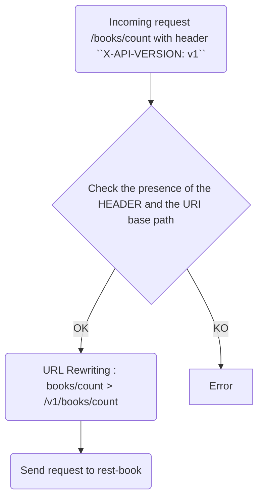

# Your first version

We will define in this chapter our first version in the URI and in a header mixing in the gateway & the apps.

> **Warning**
>
> Before starting, this chapter, please shut down all the spring apps already started:
> * [config server](../config-server)
> * [gateway](../gateway)
> * [authorization server](../authorization-server)
> * [rest-book](../rest-book)
> * [rest-number](../rest-number)

## URI based version creation

In the curent rest-book version,we will define the version in the BookController's URI.

The pattern should be like ``/api/%VERSION%/books``.
For instance, we could have ``/api/v1/books``.

Here is how we could implement it both in the backends and in the gateway.

### Configuration
#### Rest-Book

Update the [rest-book's openAPI descriptor file](../rest-book/src/main/resources/openapi.yml) adding the version in the URL:

```yaml
openapi: 3.0.0
info:
  title: OpenAPI definition
  version: "v1"
servers:
  - url: http://localhost:8082/v1
```

You can now override the default context path in the [rest-book configuration file](../config-server/src/main/resources/config/rest-book.yml)

```yaml
server:
  servlet:
    context-path: /v1
```

Now, try to build the project:

```bash 
./gradlew build -p rest-book
``` 

Update then your unit tests to reflect the version handling:

* Add the same property in
  the [application.yml test configuration file](../rest-book/src/test/resources/application.yml)

* In the ``setUp`` method
  of [BookControllerIT](../rest-book/src/test/java/info/touret/bookstore/spring/book/controller/BookControllerIT.java)
  and [OldBookControllerIT](../rest-book/src/test/java/info/touret/bookstore/spring/book/controller/OldBookControllerIT.java)
  integration tests, modify the basepath:

```java
@BeforeEach
void setUp(){
        booksUrl="http://127.0.0.1:"+port+"/v1/books";
        mockServer=MockRestServiceServer.bindTo(restTemplate).build();
        mockServer.reset();
        }

```

* To get your unit tests successfull, you will also have to modify this test ``should_register_a_book_successfully()`` by modifying this assertion:

from:
```java
assertTrue(uri.getPath().matches("/books/[1-9]+$"));
```
to:

```java
assertTrue(uri.getPath().matches("/v1/books/[1-9]+$"));
```

* In the [MaintenanceControllerIT](../rest-book/src/test/java/info/touret/bookstore/spring/maintenance/controller/MaintenanceControllerIT.java) test class, you have to modify the ``setUp()`` method in the same way than earlier:

```java
@BeforeEach
void setUp()throws Exception{
        maintenanceUrl="http://127.0.0.1:"+port+"/v1/maintenance";
        booksUrl="http://127.0.0.1:"+port+"/v1/books";
        [...]
```

Build the application:

```bash 
./gradlew build -p rest-book
``` 

##### Looking forward to rest-number api versioning updates

This module reaches [rest-number](../rest-number) through API calls.
It will be versioned later (see below).
We need to anticipate these changes:

In the [rest-book configuration file](../config-server/src/main/resources/config/rest-book.yml) , modify the following
property adding the version:

```yaml
booknumbers:
  api:
    url: http://127.0.0.1:8081/v1/isbns
```

Update the same property in the rest-book [application.yml test configuration file](../rest-book/src/test/resources/application.yml)
and finally, update the mock configuration in the test classes:

#### Rest-Number
Update the [rest-number's openAPI descriptor file](../rest-number/src/main/resources/openapi.yml) adding the version in the URL:

```yaml
openapi: 3.0.1
info:
  title: OpenAPI definition
  version: v1
servers:
  - url: http://localhost:8081/v1
```

You can now override the default context path in the [rest-number configuration file](../config-server/src/main/resources/config/rest-number.yml):

```yaml
server:
  servlet:
    context-path: /v1
```

Now, try to build the project:

```bash 
./gradlew build -p rest-number
``` 

Update then your unit tests to reflect the version handling:

Add the same property in
the [application.yml test configuration file](../rest-number/src/test/resources/application.yml)

To get your unit tests successful, you will also have to modify
the [BookNumbersControllerIT](../rest-number/src/test/java/info/touret/bookstore/spring/number/controller/BookNumbersControllerIT.java)
and [BookNumberControllerTimeoutIT](../rest-number/src/test/java/info/touret/bookstore/spring/number/controller/BookNumbersControllerTimeoutIT.java)
test classes by modifying this line in both classes:

from:

```java
var response = restTemplate.getForEntity("http://127.0.0.1:" + port + "/isbns", BookNumbersDto.class);
```
to:
```java
var response = restTemplate.getForEntity("http://127.0.0.1:" + port + "/v1/isbns", BookNumbersDto.class);
```
### In the gateway

Update the corresponding routes defined in the [gateway application.yml configuration file](../gateway/src/main/resources/application.yml).

<details>
<summary>Click to expand</summary>

```yaml
spring:
 application:
  name: gateway
 zipkin:
  base-url: http://localhost:9411
  sender:
   type: web
 cloud:
  gateway:
   routes:
    - id: path_route
      uri: http://127.0.0.1:8082
      predicates:
       - Path=/v1/books
    - id: path_route
      uri: http://127.0.0.1:8082
      predicates:
       - Path=/v1/books/{segment}
    - id: path_route
      uri: http://127.0.0.1:8081
      predicates:
       - Path=/v1/isbns
```
</details>

### Tests

#### Startup

Normally, you Docker infrastructure should be up. If not, start it:

<details>
<summary>Click to expand</summary>

```jshelllanguage
cd infrastructure 
docker compose up
```
</details>


Start then the different applications:

<details>
<summary>Click to expand</summary>
In the first shell:

```jshelllanguage
./gradlew bootRun -p config-server
```
In the second shell:

```jshelllanguage
./gradlew bootRun -p authorization-server
```

In the third shell:

```jshelllanguage
./gradlew bootRun -p rest-book
```
In the fourth shell:

```jshelllanguage
./gradlew bootRun -p rest-number
```

Last but not least, in the last one:

```jshelllanguage
 ./gradlew bootRun -p gateway
```

</details>


You can now reach the API.

For instance, you can reach the gateway:

```jshelllanguage
http:
8080 / v1 / books / count
```

You can also access directly to the rest-book backend:

```jshelllanguage
http:
8082 / v1 / books / count
```

Now you can update in the same way [your scripts](../bin) adding the version prefix.

By the way, you can also verify if the Swagger and OpenAPI is up-to-date by browsing these endpoints:

* http://localhost:8082/swagger-ui/index.html
* http://localhost:8081/swagger-ui/index.html

### Create a HTTP Header based version

In this chapter, we will put in place a rewrite/redirection mechanism in the gateway to route incoming requests
regarding an header.

For this workshop we will extract the ``X-API-VERSION`` HTTP header and route to the appropriate backend.
For instance if we reach the API as following:

```jshelllanguage
http:
8080 / books / count "X-API-VERSION: v1" 
```

Our gateway will rewrite the URL and reach the good version (i.e., the version specified by the header).

You could find below a flowchart explaining the mechanism:



We will illustrate this behaviour by adding another route in the [gateway's configuration](../gateway/src/main/resources/application.yml):

Here is an example

```yaml
[ ... ]
cloud:
 gateway:
  routes:
   - id: rewrite_v1
     uri: http://127.0.0.1:8082
     predicates:
      - Path=/books/{segment}
      - Header=X-API-VERSION, v1
     filters:
      - RewritePath=/books/(?<segment>.*),/v1/books/$\{segment}
   - id: rewrite_v1
          uri: http://127.0.0.1:8082
          predicates:
            - Path=/books
            - Header=X-API-VERSION, v1
          filters:
            - RewritePath=/books,/v1/books
        - id: rewrite_v1
          uri: http://127.0.0.1:8081
          predicates:
            - Path=/isbns
            - Header=X-API-VERSION, v1
          filters:
            - RewritePath=/isbns,/v1/isbns
```

Restart the gateway:

* Type CTRL+C first in the gateway console
* Run it again:
```jshelllanguage
./gradlew bootRun -p gateway
```

Now you can reach your versioned API in two ways:
1. By adding the version in the URI (e.g., ``/v1/books``)
2. By putting an HTTP header in the HTTP request

You can now test your API using this new way:

```jshelllanguage
http :8080/books/count "X-API-VERSION: v1" 
```

You can create now some dedicated scripts for this new approach. For instance, the [``randomBook``](../bin/randomBook.sh) script can be modified.

You MAY create the following scripts

* ``bin/countBooks-header.sh``
* ``bin/createBook-header.sh``
* ``bin/randomBook-header.sh``
* ``bin/secureCountBooks-header.sh``
* ``bin/secureISBN-header.sh``
* ``bin/secureCreateBook-header.sh``
* ``bin/secureRandomBook-header.sh``

You have to add this header as mentioned above:
```jshelllanguage
http :8080/books/count "X-API-VERSION: v1" 
```

Don't forget to make these new scripts executables:

```jshelllanguage
chmod a+x bin/*
```

Now you can test your API using either these two ways.

### Create an ``accept`` media type header based version

It is also possible to specify the version in the [``accept`` header](https://developer.mozilla.org/en-US/docs/Web/HTTP/Headers/Accept).
For example, you can define the new one defined in the last two paragraphs as following:

```cookie
Accept: application/vnd.api.v1+json
```

We won't deep dive into this mechanism because its implementation is mostly the same as the last one (i.e., .

For your information, you can define these new routes in [the gateway](../gateway/src/main/resources/application.yml).

```yaml
        # HTTP ACCEPT MEDIA TYPE HEADER VERSIONING
        - id: rewrite_accept_v1
          uri: http://127.0.0.1:8082
          predicates:
            - Path=/books
            - Header=accept, application/vnd.api\.v1\+json
          filters:
            - RewritePath=/books,/v1/books
        - id: rewrite_accept_v1
          uri: http://127.0.0.1:8082
          predicates:
            - Path=/books/{segment}
            - Header=accept, application/vnd.api\.v1\+json
          filters:
            - RewritePath=/books/(?<segment>.*),/v1/books/$\{segment}
        - id: rewrite_accept_v1
          uri: http://127.0.0.1:8081
          predicates:
            - Path=/isbns
            - Header=accept, application/vnd.api\.v1\+json
          filters:
            - RewritePath=/isbns,/v1/isbns
```

Restart the gateway (see above to know how).

You can now test them by specifying
the [``accept`` header](https://developer.mozilla.org/en-US/docs/Web/HTTP/Headers/Accept):

```jshelllanguage
http :8080/isbns "accept:application/vnd.api.v1+json" 
```

## Conclusion

In this chapter we have seen how to specify and deal with API version numbers in a gateway and the backends.
The [gateway configuration](../gateway/src/main/resources/application.yml) is intentionally simple and minimalistic.
In _the real life_ we would code a dynamic routing and filtering mechanism.


> **Note**
>
> In your opinion, which way is the best: URI, HTTP header, Accept HTTP header? And where: in the gateway or in the backend? or both?
>
> [Go then to chapter 3](./03-second_version.md)
